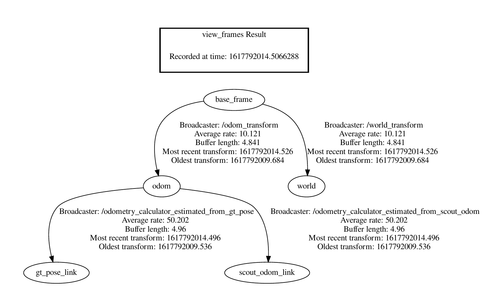

# Robotics Project 2020/2021 | First delivery

| Name             | Polimi ID | Email                           |
| ---              | ----      | ---                             |
| Luca Maltagliati | 10492601  | luca.maltagliati@mail.polimi.it |

## Description of the files and nodes

Most important files include:  

* `launch/robotics_project.launch`: A launch file which launches every necessary node to comply with project specifications.

*`frames.pdf`: The frames tree obtained with the command `rosrun tf2_tools view_frames.py`

* `src/robotics_hw1/cfg/OdometryCalculator.cfg`: The config file for the dynamic reconfigure regarding the odometry integration method

* `src/robotics_hw1/msg/CalibratedParamsGtPose.msg`, `src/robotics_hw1/msg/CalibratedParamsOdom.msg`: Some custom message I used to figure out the calibrated apparent baseline and gear ratio. They are not to be considered part of the project, but I leave them to explain how I got the estimated values.

* `src/robotics_hw1/msg/IntegratedOdometry.msg`: The custom message with the integration method and the odometry, as requested by the specifications
* `src/robotics_hw1/src/parameters_calibrator.cpp`: The node I used to calibrate gear ratio and apparent baseline, not to be considered part of the project

* `src/robotics_hw1/src/include/velocity_estimator.hpp`, `src/robotics_hw1/src/velocity_estimator.cpp`: The node that implements the functionalities required by the project. The header file contains the class definition, the cpp file implements it. I decided to split the file for more clean and readable code.

## Name of the parameters

The following parameters are used to set the start point of the object and to set the base name of the topic:  

* `init_pose_x`, `init_pose_y`, `init_pose_theta`: The starting point from where the odometry is calculated
* `wheel_radius` and `real_baseline` as given by the project specs.
* `apparent_baseline_from_scout_odom`, `gear_ratio_from_scout_odom`, `apparent_baseline_from_gt_pose`, `gear_ratio_from_gt_pose`: The estimated parameters, respectively starting from the odometry given by the robot, and from the ground truth pose.

All the parameters mentioned above are set in the launch file.

## Description of how to start/use the nodes

From a terminal in the root folder of the project:  

    catkin_make
    source devel/setup.bash
    roslaunch launch/robotics_project.launch
    
## Structure of the *tf* tree

## Structure of the custom message

As per the project specification, the custom message is structured as follows:

    nav_msgs/Odometry odom
    std_msgs/String method

The field `method` can either have the value "Euler" or "Runge-Kutta", according to the method used to integrate the odometry.

The message is published under the topic `/scout_integrated_odom_custom`

## Other infos

I estimated the `apparent baseline` and `gear ratio` values from both the odometry and ground truth pose. For this purpose I created a dedicated node, `parameters_calibrator`. The node, by using message filters, calculates for each syncronization step the value of such parameters, and then it incrementally calculates the mean in order to get a value as close as possible to the real one. In order to get a cleaner estimation I imposed bounds on the values that could contribute to the mean, with the help of plotting tools like `rviz`.

Then, by observing the plotted odometries, I verified that the value calculated starting from the `/scout_odom` is accurate: the resulting odometry is practically overlapped to the one given by the robot; on the other hand, the odometry resulting from the parameters estimated from the ground truth pose diverges a lot from the reference one, and its track follows more or less the one I could observe by plotting the `/gt_pose` topic. This is expected given the lack of precision of the odometry measured by the robot itself, as suggested during the project presentation.
